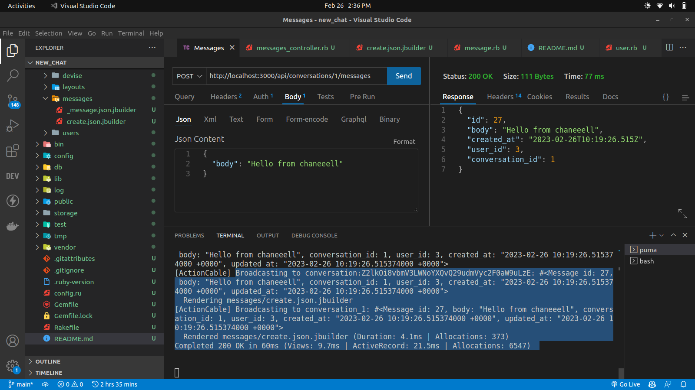

# README

## The brodcast result in the terminal with an hash key of the conversation

In this case, the ConversationChannel is an Action Cable channel that allows clients to subscribe to a particular conversation and receive real-time updates when new messages are created in that conversation.

When a client subscribes to a conversation, the subscribed method is called, and the client is "streamed" messages from that conversation using the stream_from method. When a new message is created, the broadcast_after_create method on the Message model is called, which broadcasts the new message to all clients subscribed to the conversation using the broadcast_to method on the ConversationChannel. The render method in the controller sends a JSON response back to the client with the newly created message data.